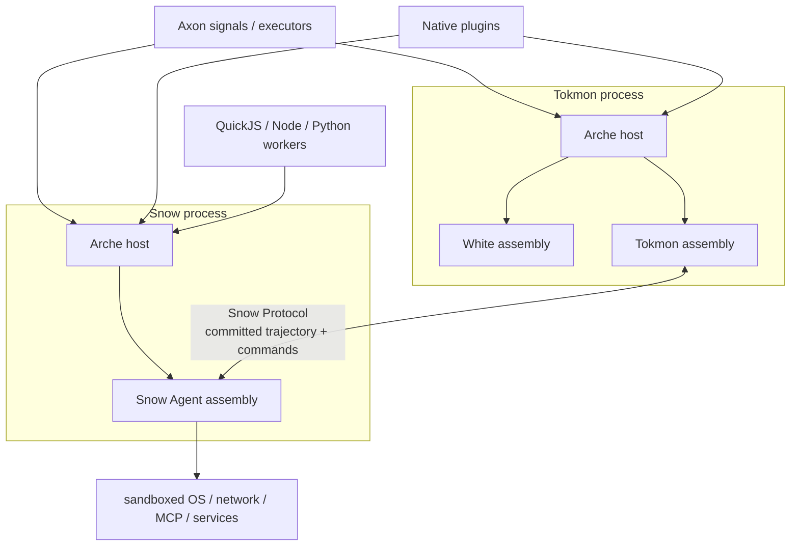
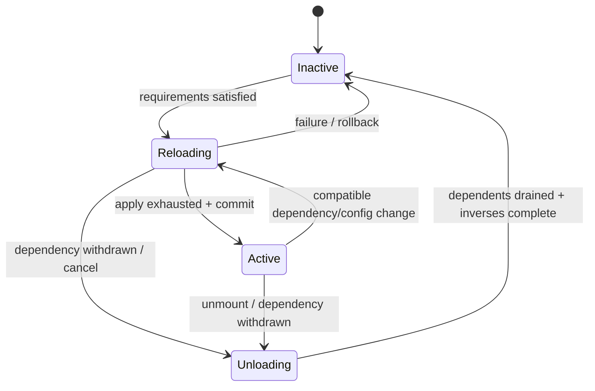
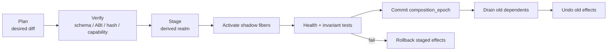
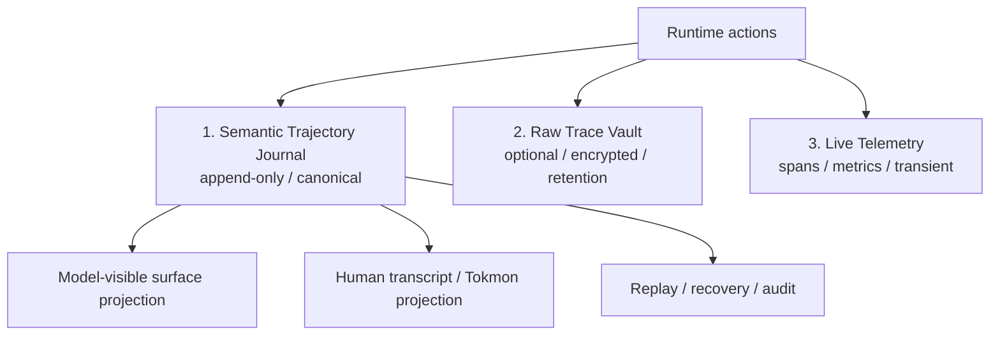
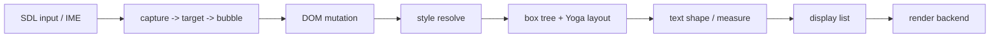

# Tokmon / Arche / Snow / White / Axon 总体设计

> 文档状态：Draft 2.0  
> 设计基线：2026-08-14  
> 核心决策：将原 `Mesh` 全面重命名并升级为 **Arche**；Arche 是 Tokmon 全系统共享的元框架微内核，也是 Agent 的“操作系统”  
> 目标目录：`axon/`、`arche/`、`white/`、`snow/`、`tokmon/`

## 1. 结论先行

Tokmon 不再被设计成“桌面程序 + Agent Kernel + GUI 库 + 一个插件管理器”的并列集合，而是建立在同一个 Arche 语义之上的多个组合体：

| 项目 | 新定位 | 公开边界 |
| --- | --- | --- |
| **Axon** | Arche 使用的轻量类型安全信号、连接生命周期与执行器机制 | C++23 API、静态/动态库 |
| **Arche** | 产品无关的时空可组合元框架微内核；管理 Context、Fiber、coeffect、effect、生命周期、组合事务和插件 ABI | C++23 API、稳定 C ABI、manifest/schema、诊断协议 |
| **Snow** | 基于 Arche 组装的 Agent Runtime 发行版；Agent loop、模型、工具、上下文、轨迹、存储等均为能力插件 | C++ SDK、C ABI、CLI、JSON-RPC/NDJSON、JS/TS/Python SDK |
| **White** | 基于 Arche 组装的 Native GUI 发行版；平台、DOM、样式、布局、绘制、输入和组件均为能力插件 | C++ API、默认插件、静态/动态库 |
| **Tokmon** | 同时组合 White 能力和 Snow 客户端能力的桌面 Agent 产品 | 桌面可执行程序、产品 manifest |

“万物皆插件”在本设计中的精确定义是：

> 除 Arche 最小可信内核、Axon 基础机制和不可绕过的宿主安全下限之外，所有产品策略、功能、适配器和可替换实现都必须以插件提供 capability；插件可以在运行时安装、挂载、组合、替换、停用和卸载，其全部可逆副作用由 Arche 记录并回收。

它不是“每个函数都动态分派”，也不是“内核不再拥有不变量”。ABI 校验、effect 逆序回收、依赖撤回顺序、权限不增、持久化提交边界和不可逆操作保护必须位于插件不能绕过的可信路径中。

核心决策：

1. **Arche 是唯一的组合内核。** White、Snow、Tokmon 不得建立私有插件管理器、全局 service locator 或第二套生命周期。
2. **所有功能都表现为 capability。** 插件声明需要什么 coeffect、提供什么 capability、产生什么 effect；消费者只依赖 contract 和 capability id。
3. **时间可组合。** 插件在任意已提交状态卸载后，其受 Arche 管理的作用必须安全撤销；部分加载失败也必须精确回滚。
4. **空间可组合。** 依赖关系由 coeffect 声明，随上下文变化动态解析；依赖出现时自动激活，依赖撤回时先停用消费者再回收提供者。
5. **组合是数据，不是启动脚本。** 宿主提交 `DesiredComposition`，Arche 将其与实际 Fiber 图做最小差异协调。
6. **自进化是受控组合事务。** Agent 可以提出、验证、暂存和测试新的插件图，但不能自行扩大权限、越过批准、修改根安全策略或跨越不可逆边界后伪装成可回滚。
7. **Snow 是 Arche 的 Agent 发行版，不再自称系统内核。** 默认只装配一个直接 tool-use loop；不存在按 prompt 隐式切换执行引擎的 RTS、Council、Squad、lane 或 MissionDispatcher。
8. **Snow 保存完整、可回放、可解释的轨迹。** 模型可见信息必须先持久化；模型请求构造、流式响应、工具、策略、审批、沙箱、artifact、压缩、子运行和组合版本都有因果来源。
9. **White 是通用 Native GUI 组合体，不是浏览器。** Lexbor、Yoga、Skia、SDL3 仍是默认实现插件，不泄漏到稳定 contract。
10. **Tokmon 只做产品组合和交互。** 它不复制 Snow 状态机，也不把 UI 投影当成 Agent 事实源。
11. **一方核心代码使用 C++23。** 原生扩展跨动态库只使用稳定 C ABI；Node、Python、QuickJS 是受控桥接运行时，不拥有 Arche 或 Snow 的核心不变量。
12. **先完成一条可恢复的纵向闭环。** 打开工作区、对话、模型流、工具、diff、审批、中断、崩溃恢复和轨迹回放必须走同一套 Arche/Snow 语义。

---

## 2. 设计目标与非目标

### 2.1 目标

- Arche 可以独立于 Snow、White 和 Tokmon 发布，并被第三方 C++ 宿主使用。
- 静态内建插件、原生动态插件和语言桥插件共享同一 manifest、Context、Fiber、effect 和 coeffect 语义。
- 任意非可信核心插件被移除或替换时，系统要么完成安全收敛，要么给出明确的阻塞原因；不能依赖偶然加载顺序。
- Snow、White 和 Tokmon 的能力图可在运行时查询、解释、局部重组和版本化。
- 每次组合变化生成单调递增的 `composition_epoch`，并可关联到 Snow 轨迹和诊断事件。
- 插件失败、动态库错误、模型断流、工具崩溃、Snow/Tokmon 进程崩溃后都能说明执行到了哪里。
- 用户能看见并控制插件来源、capability、权限、沙箱强度、文件改动、命令、网络、成本和上下文压缩。
- Windows、macOS、Linux 共享绝大多数实现，平台差异收敛到能力插件。

### 2.2 非目标

- 不把“万物皆插件”理解成每个 DOM 节点、每个 token 或每个像素都成为动态库插件。
- 不承诺对同进程不可信原生代码提供内存安全隔离；需要强隔离时使用独立 plugin-host/worker 与 RPC。
- 不声称所有外部世界副作用都可逆。邮件发送、支付、远端写入等不可逆 emission 必须使用预提交、幂等键、补偿或人工确认。
- 不允许插件替换或削弱根 ABI 校验、最终权限 guard、沙箱 broker、轨迹提交规则和 secret redaction 下限。
- 不实现 SnowCode 式 RTS、Council、Squad、Battlefield、lane、MissionDispatcher、意图分类或隐式请求路由。
- White 不实现网页导航、任意网页 JavaScript、浏览器兼容层或完整 CSS。
- 当前产品边界是本地优先的完整桌面 Agent 操作系统；云端多租户执行平台和各平台同等级强 OS 沙箱属于独立部署形态，不作为桌面实现完整性的降级借口。

---

## 3. 理论依据：时空可组合编程范式

本设计以论文 *A Programming Paradigm for Spatiotemporal Composability* 和 Cordis 实现为直接依据，但面向 C++ 所有权、稳定 ABI、跨进程安全与 Agent 轨迹重新设计。

### 3.1 从论文到工程模型

论文中的组件可以概括为：

```text
Component C = (dependencies d, provisions p, witnessed effects e)
```

- `d` 是组件声明的 coeffect：组件要求环境提供什么。
- `p` 是组件向环境提供的 capability/service。
- `e` 是组件执行产生的、带逆操作见证的 effect。
- Context `Γ` 不是只读配置，而是可递归派生、能承载 provision、coeffect 和 effect 记录的一等对象。
- 组件实例不是一个裸对象，而是隶属于某个 Context 的 Fiber。

Arche 对应关系：

| 论文概念 | Arche 工程对象 | 强制性质 |
| --- | --- | --- |
| Context `Γ` | `arche::Context` / realm | 可派生、可隔离、可拦截、无进程级 singleton |
| component | Plugin descriptor + apply procedure | 声明 require/provide，不靠静态初始化 |
| coeffect | `Requirement` + committed dependency view | 动态解析并触发生命周期变化 |
| provision | versioned capability/service | 只在 provider Active 后可见 |
| effect | `EffectLedger` 中的 inverse witness | LIFO 回收，部分失败精确回滚 |
| component instance | `Fiber` | 独立 id、parent、state、context、effect table |
| context change | composition transaction | 先暂存、验证，再原子提交 epoch |

### 3.2 时间可组合性

对 Arche 管理边界内的上下文变化，任何正向作用 `f : Γ → Γ'` 都必须同时登记逆作用。组件卸载按 LIFO 执行逆作用，使可观察上下文恢复到加载前等价状态：

```text
apply f1 -> apply f2 -> apply f3
unload: inverse(f3) -> inverse(f2) -> inverse(f1)
```

“等价”由 capability contract 的可观察行为定义，不要求内存逐字节相同。下列动作都必须成为 effect：

- service/provision 注册；
- Axon signal 连接；
- timer、watcher、subscription；
- task group 与 cancellation source；
- 文件句柄、socket、GPU/窗口资源；
- RPC handler、tool、view、command、schema 注册；
- 子 Context/Fiber；
- 临时文件、可恢复数据库租约和缓存引用。

仅提供 `start()`/`stop()` 而不记录细粒度作用是不够的。插件加载到一半失败时，Arche 必须只撤销已经提交的作用；插件不得依赖一个可能永远到不了的“大 stop”来清理。

### 3.3 空间可组合性

组件不能直接从全局注册表抓取依赖。它声明 coeffect，Arche 在当前 Context 的可见域中解析：

```text
require capability -> dependency view commit -> activate
provider disappears -> mark unavailable -> notify dependents
-> drain/unload dependents -> undo provider effects
```

关键规则：

- provider 只有进入 `Active` 后才对新消费者可见。
- provider 撤回时先从新解析中隐藏，再等待所有已提交消费者结束。
- consumer 在自己的 teardown 期间保留 committed dependency view，因此仍能调用依赖完成清理。
- provider 的 inverse 只能在依赖它的 consumer 完成停用后执行。
- required 依赖缺失使 Fiber 保持 Inactive；optional 依赖只能通过显式 optional contract 表达。
- 依赖环默认拒绝。真正互相依赖的行为应拆成更细的 capability，并由第三个 integration plugin 组合。

### 3.4 独立性、交换性与收敛

不同 key/realm 上的作用默认独立；同一 key 上的多提供者只有在 contract 明确给出交换/合并语义时才可并存。否则必须满足唯一 provider。

Arche 不把数组顺序、插件文件名或发现时间当成语义。非交换顺序必须通过以下方式显式表达：

- required coeffect；
- phase/barrier capability；
- broker/aggregator contract；
- 同一 Fiber 内 effect 的 LIFO 顺序。

在依赖图有限、无环、effect iterator 有界且独立性声明真实的前提下，不同合法调度顺序应收敛到同一个可观察静止态。Arche 的随机调度测试专门验证这一点。

### 3.5 管理边界与不可逆外部作用

时间可组合性只覆盖 Arche 能见证的作用。外部系统 emission 使用以下模式之一：

1. **withhold/commit**：先准备，直到本地事务确认才提交外部动作；
2. **idempotency key**：重试只产生一个外部结果；
3. **compensation**：登记业务补偿，而不是声称能物理撤销；
4. **outcome unknown**：崩溃后无法证明结果时停止自动重试并要求确认；
5. **human approval**：不可逆、高成本或扩权动作在 commit 前批准。

---

## 4. 总体架构：Arche 作为 Agent OS

Arche 的“操作系统”含义是：它为组件提供能力寻址、生命周期、隔离域、资源回收、装载、组合调度和诊断；Snow 则提供 Agent 领域的进程、轨迹、模型、工具和策略能力。



依赖方向：

```text
Axon -> C++ standard library
Arche -> Axon + standard library + minimal platform loader
White contracts/default plugins -> Arche + Axon
Snow contracts/default plugins -> Arche + Axon
Tokmon -> Arche + White + Snow Protocol
Snow -X-> White / Tokmon
White -X-> Snow
language bridge -> Arche C ABI + generated product contracts
```

默认桌面部署有两个 Arche root：

- Tokmon 进程挂载 White 与 Tokmon 插件，拥有窗口、输入和 UI 投影能力。
- Snow 子进程挂载 Snow 插件，拥有模型、工具、轨迹、策略和沙箱能力。
- `arche.bridge.rpc` 把选定的 capability 映射到 Snow Protocol；远端代理仍是有 lease、deadline、取消和 schema 的 capability，不是透明全局对象。

进程隔离是故障与权限边界；Arche Context 是组合与资源边界，两者不能互相替代。

---

## 5. Arche 元框架微内核

### 5.1 最小可信内核

Arche 核心只包含：

1. 稳定 id/value/error/schema 与 Native Plugin ABI；
2. `Runtime`、`Context`、realm、isolation、interception；
3. `Fiber` 与异步生命周期调度器；
4. coeffect store、依赖解析和 committed dependency view；
5. provision table、lease 与撤回协议；
6. `EffectLedger`、inverse、部分加载回滚；
7. declarative composition reconciler 与 `composition_epoch`；
8. 静态/动态 module loader 的最小抽象；
9. capability token、root policy hook 和诊断事件。

Arche 核心不包含：

- SQLite、HTTP、JSON-RPC、模型、工具、Agent loop；
- DOM、CSS、布局、绘制、窗口；
- Node、Python、QuickJS；
- 产品配置页面、插件市场、升级器；
- 任何 Snow/White/Tokmon 领域类型。

这些均由插件提供。内核越小，时空组合不变量越容易审计和测试。

### 5.2 Runtime、Context、Realm 与 Fiber

```text
Runtime
└─ root Context / trust realm
   ├─ application Context
   │  ├─ workspace Context
   │  │  ├─ session Context
   │  │  │  └─ run / tool-call Context
   │  │  └─ window / document Context
   │  └─ plugin-host Context
   └─ diagnostics Context
```

- `Runtime` 是根所有者，不允许进程级 singleton。
- `Context` 定义 capability 可见域、配置、policy interception 和子 Fiber 所有权。
- `Realm` 决定 key 如何映射到隔离空间。插件私有 realm 默认不能枚举其他插件私有配置或 secret。
- `Fiber` 是一个插件实例，包含 `fiber_id`、`plugin_id/version/hash`、parent、Context、状态、effect table、依赖快照、任务组和失败原因。
- 一个插件 package 可在不同 Context 中产生多个 Fiber；package 安装与 Fiber 激活是两件事。

### 5.3 Fiber 生命周期

论文的四态模型直接成为 Arche 的规范状态机：



异步转换采用 **inertial semantics**：

- Fiber 在 `Reloading`/`Unloading` 时不会被并发执行第二条相反转换。
- 新的环境变化只设置目标状态；当前安全点到达后继续、divert 或重跑解析。
- 每次 provision 变化带 `dependency_epoch`；旧异步结果不得覆盖新 epoch。
- apply iterator 每 yield 一个 effect，Arche 立即取得 inverse 所有权。
- apply 抛错、超时或取消时，只回滚已登记部分并留下结构化失败原因。
- stop/dispose 幂等；超时 Fiber 进入 `stuck` 诊断态，停止新路由，但不强行卸载代码页。

实现和测试名称应保留与论文规则的可追踪关系：`L-Begin/L-Iter/L-Finish` 对应开始、逐 effect 见证和提交；`L-Divert/L-Raise/L-Leave/L-Unload` 对应依赖变化转向、失败回滚、离开 Active 和逆序回收。工程状态可以增加 `stuck` 诊断标签，但不能改变这四个规范生命周期状态。

### 5.4 插件声明

插件由 package manifest 和运行时 descriptor 共同标识，二者的 id、版本、ABI 与内容 hash 不一致时拒绝加载。

```json
{
  "schema": "org.tokmon.arche.plugin/v1",
  "id": "org.tokmon.snow.provider.openai-compatible",
  "version": "1.4.0",
  "entry": {
    "kind": "native",
    "path": "snow_provider_openai.dll"
  },
  "abi": "arche-native/1",
  "host": {
    "products": ["snow"],
    "platforms": ["windows-x86_64", "macos-arm64", "linux-x86_64"]
  },
  "requires": [
    {"capability": "snow.http-client", "range": "^1.0"},
    {"capability": "snow.secret-reader", "range": "^1.0"}
  ],
  "provides": [
    {
      "capability": "snow.model-provider",
      "version": "2.1.0",
      "interface_hash": "sha256:..."
    }
  ],
  "permissions": {
    "network": ["api.example.com:443"],
    "secrets": ["provider.openai.api_key"]
  },
  "config_schema": "schemas/openai-provider.schema.json",
  "artifacts": {
    "hash": "sha256:...",
    "signature": "..."
  }
}
```

依赖标识由 `namespace + capability name + contract major + interface hash` 构成。SemVer 只表达声明兼容，结构 hash 防止 ABI 假兼容。

源码内静态插件也必须提供相同 descriptor，并通过同一个 reconciler 激活；静态链接只是分发方式。

### 5.5 插件 apply 与 effect API

推荐 C++ façade：

```cpp
class SearchToolPlugin final : public arche::Plugin {
public:
  arche::EffectStream apply(arche::Context& ctx) override {
    auto& tools = co_await ctx.require<snow::ToolRegistry>("snow.tools");

    co_yield ctx.provide<snow::Tool>("snow.tool.search", make_search_tool(ctx));
    co_yield tools.register_tool("search", make_search_tool(ctx));
    co_yield ctx.signals().connect<WorkspaceChanged>(
        ctx.executor("io"), [this](const auto& event) { on_change(event); });
    co_yield ctx.tasks().spawn(watch_workspace(ctx.stop_token()));
  }
};
```

每个 `co_yield` 返回 host 拥有的 inverse。插件可以使用 RAII façade，但不能让普通析构成为唯一的回滚见证。

### 5.6 Service、Signal、Command 与 Event

| 机制 | 用途 | 生命周期 |
| --- | --- | --- |
| capability/service | 有返回值、明确 provider 的能力调用 | provision + lease |
| Axon signal | 已发生事实的一对多进程内通知 | connection 是 effect |
| command | 唯一处理者的意图，可能被拒绝 | versioned service contract |
| durable event | 可重建的事实与审计记录 | 先提交存储，再发布 |
| transient event | 可丢弃的瞬时进度/背压提示 | 有界流，不参与恢复 |

禁止创建一个同时承担上述五种语义的“万能 event bus”。热路径在组合完成后持有 typed lease 并直接调用 vtable；不要求绘制每个节点或处理每个 token 都走动态查找。

### 5.7 多 provider 与 broker

同一 capability 默认唯一 provider。需要负载均衡、fallback、rolling update 或聚合时，不让消费者依赖“所有 provider 的偶然数组”，而是装配一个 broker：

```text
provider A ─┐
provider B ─┼─> model-provider-broker ─> snow.model-provider
provider C ─┘
```

broker 显式拥有选择、健康检查、切换、顺序与 drain 语义。提供者升级时旧调用继续持有旧 lease，新调用只进入已提交的新 provider。

### 5.8 隔离与拦截

Context 支持两种不同机制：

- `isolate(key -> realm)`：改变 capability/config 的命名空间和可见域。
- `intercept(key, policy)`：不改变身份，但在解析或调用时衰减 capability、注入审计、限额、deadline 或 deny。

子 Context 的有效权限只能是父 Context 权限的子集：

```text
effective_caps(child) = parent_caps ∩ manifest_request ∩ user_policy ∩ runtime_guard
```

依赖声明同时承担最小 capability 可见性，但不等同于 OS 沙箱。同进程 native plugin 仍可用未定义行为绕过语言级限制，因此未知代码必须进入 worker/plugin-host。

### 5.9 诊断是内核能力

Arche 必须能回答：

- 当前有哪些 Context、Fiber、provision 和 lease？
- 某 Fiber 为什么 Active、Inactive、Reloading、Unloading 或 stuck？
- 某 capability 最终解析到谁，经过了哪些 realm/interceptor？
- 哪个 coeffect 阻止了激活？
- 哪个 dependent 阻止 provider 卸载？
- 某次组合事务增加、替换和移除了什么？
- 哪个 effect 未完成 inverse，耗时多久？

`arche inspect` 输出机器可读图和人类可读 explanation；Snow 和 Tokmon 可以把运行相关事件关联到 `fiber_id` 与 `composition_epoch`。

---

## 6. 动态安装、组合、替换与卸载

### 6.1 统一词汇

| 操作 | 含义 |
| --- | --- |
| `install` | 获取、校验并登记一个插件 package；不代表已执行 |
| `mount` | 在某 Context 中创建 Fiber，并在依赖满足时激活 |
| `reconcile` | 将实际 Fiber 图收敛到声明的目标组合 |
| `reload` | 依赖、配置或实现改变后重新 apply 并原子提交 |
| `unmount` | 停用一个 Fiber，按依赖顺序回收 effect；package 仍可保留 |
| `uninstall` | 在无 Fiber、lease、迁移任务和 pin 后删除 package |
| `upgrade` | 暂存新版本，通过兼容/健康检查后替换旧版本 |

### 6.2 DesiredComposition

组合清单必须稳定、可序列化：

```json
{
  "schema": "org.tokmon.arche.composition/v1",
  "id": "tokmon.desktop.default",
  "plugins": [
    {
      "instance": "white.backend.raster",
      "package": "org.tokmon.white.backend.skia-raster@^1",
      "realm": "ui"
    },
    {
      "instance": "tokmon.snow.client",
      "package": "org.tokmon.tokmon.snow-rpc@^1",
      "config": {
        "endpoint": "owned-child-process"
      }
    },
    {
      "instance": "tokmon.view.conversation",
      "package": "org.tokmon.tokmon.view.conversation@^1"
    }
  ],
  "disabled": [],
  "locks": {
    "source": "composition.lock.json"
  }
}
```

reconciler 以 stable `instance` id 区分移动、配置更新和真正替换，执行最小 diff。文件顺序不形成依赖语义。

### 6.3 组合事务



提交前：

- 校验签名、来源、ABI、平台、contract 和依赖 DAG；
- 计算新增权限与不可逆 migration；
- 在派生 realm 中加载，不能污染当前 Active 图；
- 完成 plugin-defined health check、host invariant check 和可选 differential fixture；
- 确认安全切换点，例如 Snow turn/step 边界或 White frame 边界。

提交时只原子切换 provision view 和 `composition_epoch`。旧 Fiber 随后按 consumer-first 顺序 drain。若提交前失败，现有图不变；提交后发现旧 Fiber 回收失败，新图仍保持有效并产生维护告警，不能反向暴露半旧半新依赖。

### 6.4 HMR 与自进化共用一条路径

开发期 HMR 和生产自进化不另建快捷通道：

1. watcher/agent 产生候选 package；
2. loader 备份 module cache 与旧 descriptor；
3. reconciler 在 staging realm 激活候选；
4. fixture、健康检查、权限差异和资源预算通过；
5. 在 quiescent point 提交新 epoch；
6. 失败恢复旧 module cache 与旧 Fiber 图。

自进化 Agent 只能提交 `EvolutionProposal`：

```text
proposal =
  desired composition diff
  + package hashes/signatures
  + requested capability delta
  + data migration plan
  + tests/evidence
  + rollback/compensation plan
```

默认规则：

- 不得自动安装未签名原生插件；
- 不得自动扩大 filesystem/network/secret/process capability；
- 不得修改 root guard、trajectory invariant 或 Arche ABI policy；
- 涉及 schema migration、外部 emission 或权限增加时必须审批；
- 每次提案、验证、批准、提交或回滚均写入 Snow 完整轨迹；
- 进化失败只影响 staging realm，不能让当前会话失去可恢复性。

这使“自进化”成为可审计的操作系统升级事务，而不是 Agent 直接重写正在执行的自身。

### 6.5 卸载算法

卸载 provider `P`：

1. 将 `P` 的 provision 标记为 unavailable，阻止新 consumer；
2. 找出已提交依赖 `P` 的 Fiber，并按反向依赖拓扑进入 Unloading；
3. consumer 使用 committed view 完成 teardown；
4. 等待 consumer task、lease、signal connection 和 effect 释放；
5. 对 `P` 执行 inverse；
6. 删除 provision table 记录和 Fiber；
7. 仅在动态库无回调、线程、TLS、对象和 allocator 所有权后允许卸载代码页。

v1 默认“逻辑卸载、保留代码映射”。真正 `FreeLibrary`/`dlclose` 只对通过 ABI unload stress test 的插件开放。

---

## 7. Native ABI 与语言生态

### 7.1 稳定 C ABI

原生插件查询入口：

```c
ARCHE_EXPORT arche_status
arche_plugin_query_v1(
    const arche_host_api_v1* host,
    arche_plugin_descriptor_v1* out_descriptor);
```

ABI 边界规则：

- 只传 fixed-width integer、UTF-8/byte span、opaque handle、versioned function table；
- 不跨边界传 STL、C++ exception、RTTI、coroutine frame 或 allocator-owned object；
- 谁分配谁释放，释放函数随 handle 一起返回；
- 所有 callback 注册返回 effect token；
- async 使用 poll/completion/stream function table，并带 deadline/cancel；
- descriptor 标明 target triple、pointer width、endianness、build mode 和可选 toolchain id；
- ABI contract、fuzz corpus 和 host harness 独立发布。

### 7.2 QuickJS、Node 与 Python

三种运行时都是 Arche 插件，不进入微内核：

| Bridge | 定位 | 默认隔离 |
| --- | --- | --- |
| `arche.quickjs` | 小型受控标准 JavaScript/ESM 插件 | 独立 realm，无 Node builtin、无直接文件/网络 |
| `arche.node-worker` | 真实 Node/npm 生态 | 长寿命子进程，lockfile/integrity，受控 IPC |
| `arche.python-worker` | Python 包和数据/自动化生态 | 子进程 + venv/lock，隔离 GIL/ABI |

所有桥都映射显式标记为 `scriptable` 的 capability。默认禁止启动时隐式 `npm install`/`pip install`，禁止未审计 lifecycle script。worker 崩溃使代理 capability 失效，并触发正常的空间组合停用，而不是留下悬挂对象。

Node/Python embedded 模式只作为受信任实验后端；它们不能替换 Snow loop、最终权限 guard、sandbox broker 或 trajectory commit。

---

## 8. Axon 重新定位

Axon 是 Arche 的底层机制，不是另一个微内核。它只知道 callable、connection、lifetime 和 executor，不知道 Context、插件、DOM、Agent 或 RPC。

Axon 提供：

- `Signal<Args...>` 与 RAII `Connection`；
- weak owner/lifetime token；
- direct、queued、strand executor；
- `std::stop_token` 与 queued cancel；
- 稳定连接顺序、嵌套 emit 和并发 disconnect 语义；
- slot 错误隔离与 error sink。

Arche 通过 `SignalHub` façade 使用 Axon：

- 每个 connection 自动登记为当前 Fiber 的 effect；
- queued callback 捕获 Fiber lifetime 和 composition epoch；
- Fiber 进入 Unloading 后拒绝新 callback；
- 跨动态 ABI 映射成 `schema_id + opaque payload + function table`；
- 产品不得绕过 Context 建立永生的全局 Signal。

执行器实现可以由 capability 插件提供，例如 `axon.executor.ui`、`axon.executor.io`、`axon.executor.compute`。Axon 的核心模板 API 仍保持独立和低开销。

---

## 9. Snow：基于 Arche 的 Agent Runtime

### 9.1 Snow 不再拥有第二个“内核”

Snow 是一组 Agent capability contract、默认插件和 SDK façade。Arche 管理这些插件的组合与生命周期。

默认 Snow assembly：

```text
snow.host
├─ snow.session.trajectory
├─ snow.session.sqlite
├─ snow.loop.direct
├─ snow.context.default
├─ snow.model.gateway
│  └─ snow.provider.*
├─ snow.tools.registry
│  ├─ snow.tool.read/search
│  ├─ snow.tool.shell
│  └─ snow.tool.edit
├─ snow.policy.default
├─ snow.approval
├─ snow.sandbox.<platform>
├─ snow.artifact.store
├─ snow.compaction.default
├─ snow.skills / instructions / memory
├─ snow.mcp
├─ snow.protocol.server
└─ snow.telemetry
```

每个条目提供 capability。SDK、CLI、stdio server、Tokmon 和第三方客户端进入同一个 `snow.agent-loop` capability；不能复制循环。

### 9.2 唯一默认直接循环

一个 session Context 同时最多有一个 `snow.agent-loop/v1` provider。默认实现 `snow.loop.direct`：

```text
claim input
-> durable turn/start
-> assemble model-visible surface
-> durable request/header + request/context
-> model stream
-> durable assistant chunks/message
-> validate tool calls
-> policy + approval + sandbox
-> execute tools
-> durable ordered results
-> next step or durable turn/end
```

- `turn` 是一次用户驱动的运行边界。
- `step` 是一次模型请求以及该响应产生的工具批次。
- 模型不再请求工具时默认完成。
- profile/agent 由用户或 SDK 在 `turn/start` 前显式选择；不根据 prompt 隐式路由。
- 兼容的新 loop 实现可以在显式组合事务、无 active turn 的安全点替换，但一个 Context 只解析到一个 provider。
- RTS、Council、Squad、lane、Intent Classifier 和自动 Planner 不得通过插件重新进入默认或隐藏路径。

### 9.3 完整轨迹：三个平面

Snow 采用类似 DeepSeek Harness、但覆盖组合与安全决策的完整轨迹架构。



1. **Semantic Trajectory Journal** 是规范事实源，默认持久保存足以重建 Agent 行为的结构化事件。
2. **Raw Trace Vault** 可选保存 provider 原始 HTTP/SSE frame、工具 stdout/stderr 原始块等高敏高体积数据，以 hash/reference 关联 journal，并受加密、脱敏和保留期控制。
3. **Live Telemetry** 保存 span、metric、queue depth 和未提交进度；可以采样或丢弃，不能用于业务恢复。

这三者不能混淆。完整轨迹不意味着默认永久保存所有 secret，也不意味着可以获取模型未公开的隐藏思维链。只记录 provider 实际返回的 reasoning content、reasoning summary 或 opaque reference；绝不推测或伪造私有 chain-of-thought。

### 9.4 轨迹事件封装

```cpp
struct TrajectoryEvent {
  EventType type;
  SchemaVersion schema;
  std::uint64_t seq;
  Timestamp time;

  TraceId trace_id;
  SessionId session_id;
  optional<RunId> run_id;
  optional<TurnId> turn_id;
  optional<StepId> step_id;
  optional<ModelCallId> model_call_id;
  optional<ToolCallId> tool_call_id;
  optional<SpanId> span_id;
  optional<SpanId> parent_span_id;

  arche::FiberId producer_fiber;
  arche::CompositionEpoch composition_epoch;
  vector<uint64_t> source_event_seqs;
  bool ignorable;
  Value data;
};
```

规则：

- `seq` 在事务提交时分配，不能由插件自行伪造。
- event type 按插件 namespace 扩展，例如 `snow.model/*`、`snow.tool/*`。
- 未知 `ignorable=false` 事件阻止语义回放；只有确实可跳过的观察性事件才可标记 `ignorable=true`。
- 插件必须在 manifest 中声明事件 family、schema、projection 和 invariants。
- plugin-specific invariant 由插件提供 validator；core validator 检查 turn/step 嵌套、编号、因果来源和 tool call/result 配对。
- 所有写入遵守 append-before-observe：下一步模型可见、客户端确认或外部执行所依赖的事实必须先提交 journal。

### 9.5 规范事件族

| 事件族 | 必须记录的事实 |
| --- | --- |
| session | `created`、`header`、`end-seed`、`forked`、`closed` |
| run/turn/step | start、状态转换、预算、end reason、错误/中断 |
| input | inbox 入队、next-turn/next-step/steer、claim 边界、user message |
| request | provider/model/config、system prompt hash/snapshot、工具 schema、有效 surface、路由与重试参数 |
| model | request accepted、raw semantic chunk、assistant chunk/message、usage、finish reason、provider error |
| tool | proposed call、规范化参数、admission、policy decision、approval、sandbox plan、start/progress/result |
| artifact | preimage、postimage、diff、snapshot、content hash、外部引用 |
| context | source contribution、token budget、drop/truncate、compaction replacement 与 provenance |
| memory/skill | 读取来源、版本/hash、允许写入的变更 |
| child run | parent link、delegation depth、start/end、结果引用 |
| composition | proposal、验证、权限差异、`composition_epoch`、Fiber/capability 变化、rollback |
| recovery | checkpoint、flush、crash repair、pending call resolution、`outcome_unknown` |

典型序列：

```text
session/header
session/end-seed
run/start
turn/start
inbox/claimed
step/start
user/message
request/header
request/context
model/request
assistant/chunk*
assistant/message
tool/call*
tool/policy-decision*
approval/request? -> approval/result?
tool/start* -> tool/result*
step/end
... next step ...
turn/end
run/end
```

assistant 流式 chunk 按原始语义顺序无损持久化。实现可以在同一事务中压缩/打包连续 chunk，但加载后必须恢复完全相同的事件序列；Tokmon 可在 8–16 ms 内批量渲染，不改变 journal 事实。

`turn/end` 的规范原因至少包括 `completed`、`aborted(cause)`、`blocked`、`error`、`max_tokens` 和 `interrupted(crash_repair)`；不能把取消、等待批准、预算耗尽和进程崩溃都折叠成普通 error。持久 `session/*`/`turn/*` 事实与实时 `agent/*` 状态通知分离，后者丢失后必须能从 journal 重建。

### 9.6 Raw log、surface 与 compaction

append-only raw journal 不直接等于模型输入。`SurfaceProjection` 从事件派生模型可见序列：

```cpp
struct SurfaceItem {
  SurfaceId id;
  Role role;
  Content content;
  vector<uint64_t> source_event_seqs;
  SurfaceOp op; // append | replace(start, end)
};
```

- 模型可见的每个 item 都有 provenance。
- compaction 不删除历史，而是追加 replacement event，把一段 surface 替换为摘要。
- 人类 transcript 可基于 append-origin 事件，因此模型压缩不会抹掉用户看到的原始历史。
- `request/header` 保存有效模型配置、system prompt、tool schema 和 composition epoch；`request/context` 保存本次实际 surface 与来源，保证精确重建。
- fork header 保存 parent、seed length、cwd、agent preset、origin 和 delegation depth；`session/end-seed` 区分继承历史与新进程产生的事件。

### 9.7 回放等级

| 等级 | 能力 | 是否调用外部世界 |
| --- | --- | --- |
| R0 Transcript | 重建人类可见对话、工具卡片和状态 | 否 |
| R1 Request reconstruction | 精确重建每次模型请求与有效插件图 | 否 |
| R2 Control replay | 使用记录的模型/工具结果重演 loop、projection 和策略状态机 | 否 |
| R3 Live re-execution | 使用相同输入重新调用模型和工具 | 是；结果不保证确定 |

可复现性由以下 lock 共同决定：插件 package hash、composition epoch、模型/provider 配置、tool schema、instruction/skill/memory hash、workspace snapshot、环境摘要和随机种子。缺少其中一项时回放报告必须说明降级，而不是声称完全确定。

### 9.8 崩溃一致性

- journal 使用 SQLite/WAL 单写者或等价事务存储。
- 模型请求前提交 `request/*`；外部工具执行前提交 call、policy、approval 和 canonical plan。
- tool result 必须提交后才进入下一次模型 surface。
- parallel tool 可以重叠执行，但 result 按模型调用顺序提交；exclusive tool 形成 barrier。
- 中断后为未开始的调用生成结构化 `skipped`，为已取消调用生成 `aborted`。
- side-effecting tool 带 idempotency key、preimage/artifact 和执行阶段。
- 崩溃时处于 dispatched 但未确认结果的工具标为 `outcome_unknown`，禁止盲目重跑。
- checkpoint 是性能优化与恢复边界，不替代 append-only journal。
- 启动 repair 将未闭合 turn/step 标记为 `interrupted`，保留原因和最后 committed seq。

### 9.9 工具、安全与审批

工具调用管线固定为：

```text
schema validate
-> normalize canonical plan
-> hard deny
-> plugin policy chain (only narrows)
-> approval decision
-> sandbox capability plan
-> durable dispatch record
-> execute
-> artifact/result budget
-> durable result
```

权限与沙箱分离：

- approval 决定“用户是否同意”；
- capability 决定“插件被授予什么”；
- sandbox 决定“OS 是否能阻止越权”；
- trajectory 决定“发生过什么”。

插件 hook 只能拒绝、缩小或增加审批，不能放宽 root policy。路径访问使用 canonical path/handle 校验，防止 symlink、junction、case-fold 与 `..` 绕过。secret 在模型、日志、UI 和 raw vault 各出口分别脱敏。

### 9.10 Context、memory、instruction、skill 与 MCP

Context Engine 由 source plugins 提供 contribution：

```text
system policy
-> agent/profile
-> workspace instructions
-> skills
-> memory
-> conversation surface
-> tool schemas/results
```

每个 contribution 记录来源、hash、token、优先级、可裁剪性和敏感级别。预算不足时按声明策略 drop/truncate/compact，并写 provenance event。

所有文件型 source 必须通过 `snow.config-layout` capability 解析路径，禁止在 instruction、skill、memory、MCP 或 provider 插件中硬编码 `.snow`。该 capability 的 `config_dir_name` 默认是 `.snow`，但由嵌入宿主在 Snow bootstrap 时统一设置；详细规则见 12.2。

MCP 是 ToolProvider 插件，经过相同 policy、approval、sandbox、result budget 和 trajectory 管线。server 提供的 destructive/read-only annotation 只是输入，不替代 Snow 判断。

child run 只允许由用户、SDK 或明确 tool capability 创建，并记录 parent link；不根据 prompt 自动委派。是否允许某个 Agent profile 使用 child-run capability 由 composition/policy 决定。

### 9.11 Model Gateway

provider 插件只负责：

- provider capability 发现；
- Snow request 与厂商格式转换；
- SSE/WebSocket/HTTP stream 归一化；
- reasoning/tool-call/usage/finish reason 映射；
- retryable error 分类和 rate limit metadata。

Gateway 不拥有 session 状态，不自行丢弃 chunk，不直接执行工具。retry 每次产生独立 model-call id，并与原请求因果关联。fallback 由显式 broker plugin 提供，不能隐藏在 provider `catch` 中。

### 9.12 SDK、CLI 与进程协议

所有入口共享相同能力：

```text
C++ snow::sdk
snow CLI
snow serve --stdio
@tokmon/snow
tokmon_snow
optional Node-API / Python native binding
```

协议采用双向 JSON-RPC 语义、NDJSON framing：

- `initialize` 交换 protocol range、schema、client info 和 capability；
- session create/resume/fork/close；
- turn start/steer/cancel；
- server-initiated approval request；
- committed trajectory subscribe/replay with cursor；
- transient telemetry subscribe；
- composition inspect/propose/apply（受权限限制）；
- artifact/blob 分块读取；
- bounded queue、deadline、cancel、重连和背压。

客户端只有在收到 committed seq 后推进 durable cursor。高频事件可以传输层 batch，但不能改变顺序或可回放内容。

---

## 10. White：基于 Arche 的 Native GUI

### 10.1 定位

White 是通用 retained-mode GUI assembly，不出现 `agent`、`session`、`tool_call` 等产品概念。

默认实现：

| 能力 | 默认插件 |
| --- | --- |
| platform/window/input/IME | SDL3 adapter |
| HTML/DOM/CSS parsing/selector | Lexbor adapter |
| flex layout | Yoga adapter |
| text shaping/measure/paint | Skia/SkParagraph adapter |
| renderer | Skia Raster；后续 Ganesh GL |
| accessibility | platform-specific bridge |

White 自己定义稳定的 `DomService`、`StyleResolver`、`LayoutEngine`、`TextMeasureService`、`DisplayListBuilder`、`RenderBackend`、`InputSource` 和 `AccessibilityBridge` contract。第三方类型只存在于默认插件内部。

### 10.2 Context 层级与插件图

```text
White runtime Context
└─ application
   └─ window
      └─ document
         └─ component subtree / overlay / view
```

- window 关闭自动回收平台句柄、input subscription、timer 和 renderer resource。
- document Fiber 拥有 DOM 及 White sidecar；mutation 通过 contract 标记 dirty。
- widget/view package 可以是插件，具体 DOM node 仍是高效数据对象，不强制一节点一 Fiber。
- renderer backend 只能在 frame 安全点切换；旧 display list lease 用完后再回收旧 backend。
- 外部 view plugin 停用时，其 DOM、state subscription、command、shortcut 和 resource 全部随 effect 回收。

### 10.3 Pipeline



Arche 管理阶段 provider 和生命周期，White host 只保留不可破坏的 frame barrier、dirty propagation 和 UI thread 规则。装配完成后 pipeline 使用 typed leases 直调，不经过 JSON 或通用 signal 绘制。

### 10.4 CSS、布局和渲染边界

- 稳定 CSS 基线支持 selector、cascade、inheritance、box model、Flexbox、尺寸、margin/padding/border、颜色、字体、overflow、基本 position、scroll 与 pseudo-state。
- 不支持 Grid、Float、Table layout、网页导航和任意 web animation。
- Yoga 只计算 box geometry；White 负责 CSS 到 Yoga 映射、intrinsic measure、baseline、scroll、clip 和 pixel rounding。
- SkParagraph/Skia 是文字测量与绘制的唯一事实源，覆盖 CJK、emoji、RTL、selection 和 IME。
- 稳定 backend 基线是 Skia Raster；Ganesh GL 是兼容 capability provider，Graphite/Metal/Vulkan/D3D 由同一 capability contract 按平台演进。
- streaming 文本在帧窗口内合并；VirtualList 只实例化可见项，避免一条 chunk 一次完整 layout。

### 10.5 事件、组件和状态

输入阶段固定为 capture → target → bubble。listener connection、focus capture、pointer capture、shortcut、timer 和 animation 都是当前 Context 的 effect。

White 提供：

- 低层 DOM/style/layout/paint C++ API；
- 高层 `ViewBlueprint`、`ComponentRegistry` 和 `DeclarativeView` contract；
- 严格 JSON 的 `org.tokmon.white.view/v1` 文档格式，支持组件、属性、子树、槽位、样式和 command event；
- `$bind`、`$eq`、`$not`、`$and`、`$or`、`$concat` 表达式，以及 `If`、`Repeater` 结构组件；
- keyed presentation-state reconciliation、immutable snapshot replacement 与批量 state transaction；
- Button、TextField、TextArea、ScrollView、ListView、SplitPane、Dialog、Menu、Tabs、Overlay 等默认组件；
- accessibility tree、role/name/state/action 与平台桥。

White 不执行网页 JavaScript。产品状态由外部 projection/service 提供，White 只订阅 immutable snapshot 并发出 command。

### 10.6 声明式文档与产品集成

White 的声明式文档是 UI syntax tree，不是运行时配置或脚本。文档只解析一次；帧循环消费已经展开的组件树和 typed service lease，不在每帧重新解析 JSON。产品可以注册复合组件，复合组件通过 `props` 接收参数并通过 `Slot` 接收调用方子树。事件只发出 command，业务状态仍由产品 reducer/projection 持有。

```json
{
  "schema": "org.tokmon.white.view/v1",
  "imports": ["White.Controls@1"],
  "components": {
    "SessionRow": {
      "type": "Button",
      "text": {"$bind": "props.title"},
      "on": {
        "click": {
          "command": "session.switch",
          "arguments": {"id": {"$bind": "props.id"}}
        }
      }
    }
  },
  "root": {
    "type": "Application",
    "children": [
      {
        "type": "Repeater",
        "key": "sessions",
        "model": {"$bind": "sessions"},
        "as": "session",
        "keyPath": "id",
        "children": [
          {
            "type": "SessionRow",
            "properties": {
              "title": {"$bind": "session.title"},
              "id": {"$bind": "session.id"}
            }
          }
        ]
      }
    ]
  }
}
```

Tokmon 的 Workbench shell 本身使用这一文档模型声明菜单栏、可折叠侧栏、会话区、输入区、文件预览和资源树。Tokmon 只计算响应式产品策略并提交状态；White 展开结构、计算区域和维持组件运行时状态。轨迹、Markdown 和编辑器等高密度视图可继续作为专用 paint contribution 挂入声明式区域，不把产品概念反向放进 White。

---

## 11. Tokmon：Arche 上的桌面 Agent 产品

### 11.1 产品组合

Tokmon 的 root composition 挂载：

```text
Tokmon application Context
├─ White default assembly
├─ Snow process supervisor
├─ Snow RPC capability bridge
├─ workspace/session projection
├─ conversation/tool/artifact view contributions
├─ approval/diff/terminal commands
├─ settings/secret/update/diagnostics
└─ optional signed product plugins
```

Tokmon 不拥有 Agent loop、canonical history、tool executor 或模型凭据。UI 状态来自 Snow committed trajectory 的 reducer；本地只缓存 cursor、projection snapshot 和纯 UI preference。

### 11.2 内部能力

| Capability | 职责 |
| --- | --- |
| `tokmon.snow-supervisor` | 启动、握手、监控、升级和停止 Snow 子进程 |
| `tokmon.snow-client` | typed RPC、重连、cursor 和背压 |
| `tokmon.session-projection` | 将 trajectory 归约成 UI snapshot |
| `tokmon.workspace` | 工作区列表、recent、外部路径交互 |
| `tokmon.view-contributions` | sidebar、conversation、tool card、diagnostics 等 view |
| `tokmon.approval-presenter` | 展示 canonical plan、权限和 sandbox 强度 |
| `tokmon.artifact-presenter` | diff、文件、终端、图像和 trace |
| `tokmon.settings` | schema 驱动设置，不直接持有插件 secret |

不存在持有所有对象的 `AppController`。composition root 只提交 manifest；模块依赖 contract，不依赖 concrete class。

### 11.3 关键数据流

```text
White input
-> Tokmon command
-> Snow RPC
-> Snow durable trajectory
-> committed event stream
-> projection reducer
-> immutable ClientSnapshot
-> White dirty/layout/paint
```

审批按钮可以立即进入本地 disabled 状态，但“已批准/已执行”只接受 Snow committed event。插件化 tool card renderer 可动态安装；卸载 renderer 不影响 canonical history，未知事件仍可显示通用结构化卡片。

### 11.4 线程和进程

| 执行域 | 任务 |
| --- | --- |
| Tokmon main/UI executor | SDL event、White mutation/layout/paint、Skia present |
| Tokmon IO executor | Snow RPC、文件选择器回调、更新下载 |
| Snow process | 模型、Agent loop、工具、SQLite、sandbox |
| Arche workers | 受限 Node/Python/plugin-host |

跨线程 payload 使用 immutable/value 或显式共享所有权。Tokmon UI 不阻塞等待 Snow；Snow crash 后 supervisor 重启并从最后 durable cursor 恢复。

---

## 12. 配置、存储与路径

### 12.1 配置分层

```text
compiled defaults
< product composition
< system policy
< user config
< workspace config
< session/profile config
< explicit turn override
```

每层经 schema 校验；子层不能扩大上层拒绝的 capability。插件配置位于 `plugin.<id>.<instance>` realm，secret 只以 handle 引用。

所有机器可读配置统一使用 **UTF-8 JSON**：

- 插件 manifest、产品配置、Snow 配置、provider、MCP、composition、policy、lock metadata 均使用 `.json`。
- 每类配置都有版本化 JSON Schema；加载顺序固定为“解析 JSON → schema 校验 → 语义/权限校验 → 构造 immutable typed value”。
- 不支持 YAML、TOML、JSON5、注释或尾随逗号，避免不同语言解析器产生语义差异。
- `instructions.md`、skill 文档和 memory 文本属于内容资产，不是结构化配置，因此可以继续使用 Markdown；其 metadata 若独立存储则必须是 JSON。
- secret 不直接写入 JSON，只保存 secret handle/reference。

### 12.2 可配置的 Snow 配置目录名

Snow 的项目级配置目录名只有一个统一事实源：

```cpp
struct SnowBootstrapConfig {
  std::string config_dir_name = ".snow";
};
```

典型取值：

| 使用方式 | `config_dir_name` |
| --- | --- |
| Snow CLI、独立 SDK 默认值 | `.snow` |
| 集成到 Tokmon | `.tokmon` |
| 第三方产品嵌入 Snow SDK | 由宿主设置，例如 `.acme-agent` |

该值属于 **bootstrap 配置**，不能再从它所命名的目录内部读取，否则会形成路径发现循环。优先级为：SDK/宿主显式参数或 `snow serve --config-dir-name` > 产品 bootstrap 配置 > 默认 `.snow`。

各语言 façade 映射同一字段：

```cpp
auto snow = snow::Sdk::create({.config_dir_name = ".acme-agent"});
```

```ts
const snow = await Snow.connect({ configDirName: ".acme-agent" });
```

```python
snow = await Snow.connect(config_dir_name=".acme-agent")
```

SDK、CLI、server 和嵌入式运行时必须把该值传给同一个 `snow.config-layout` capability。它统一派生以下位置：

```text
<workspace>/<config_dir_name>/instructions.md
<workspace>/<config_dir_name>/skills/
<workspace>/<config_dir_name>/memory/
<workspace>/<config_dir_name>/mcp.json
<workspace>/<config_dir_name>/providers.json
<workspace>/<config_dir_name>/composition.json
```

约束：

- `config_dir_name` 是单个目录名，不是任意路径；拒绝绝对路径、路径分隔符、空值、`.` 和 `..`。
- 解析后仍要验证目录位于 workspace 内，并按平台处理大小写、symlink 和 junction。
- 名称在 Arche/Snow bootstrap、加载任何 workspace source 之前确定，并在一个 session/run 内冻结。
- 修改名称属于配置布局切换：在无 active step 的安全点创建新 composition epoch，并重新加载所有文件型 source。
- 选择自定义名称后，不再偷偷合并或回退读取 `.snow`，避免同一配置出现两个事实源和权限意外。迁移旧目录必须由显式迁移命令完成。
- 已解析的目录名、配置文件 hash 和 contribution provenance 写入 `session/header` 与 `request/context`；绝对路径可按隐私策略归一化或脱敏。
- Snow 的运行数据根目录、数据库和 artifact 路径是独立的 `data_root` 配置，不能因为修改 `config_dir_name` 而被隐式搬迁。

Tokmon 的默认 Snow bootstrap 配置为：

```json
{
  "snow": {
    "config_dir_name": ".tokmon"
  }
}
```

因此 Tokmon 工作区中的 Snow instructions、skills、memory、MCP 和 composition 都统一位于 `.tokmon/`，不会同时生成 `.snow/`。

### 12.3 建议路径

```text
Tokmon home/
├─ config/
│  ├─ tokmon.json
│  ├─ snow.json
│  └─ compositions/
├─ plugins/
│  ├─ packages/
│  ├─ staging/
│  ├─ composition.lock.json
│  └─ trust.db
├─ data/
│  ├─ snow.db
│  ├─ artifacts/
│  ├─ trace-vault/
│  └─ projections/
├─ logs/
└─ crash/

workspace/
└─ <config_dir_name>/              # Snow 默认 .snow；Tokmon 默认 .tokmon
   ├─ instructions.md
   ├─ skills/
   ├─ memory/
   ├─ mcp.json
   ├─ providers.json
   └─ composition.json
```

### 12.4 数据库

建议逻辑表：

- `trajectory_events(session_id, seq, type, schema, envelope, checksum)`；
- `trajectory_blobs(blob_id, hash, codec, encryption, retention, path)`；
- `surface_checkpoints(session_id, seq, projection_version, data)`；
- `session_headers`、`artifacts`、`tool_executions`；
- `installed_packages`、`composition_epochs`、`composition_locks`；
- `schema_migrations`、`crash_repair`。

同一 Snow home 默认单 writer，通过进程锁保护。projection/checkpoint 可以重建，不成为第二事实源。数据库迁移是潜在不可逆边界：升级前备份，必要时采用 expand/migrate/contract 和双读，不假装普通 effect 能瞬间回滚大规模数据变更。

---

## 13. 安全模型

### 13.1 信任层级

```text
Arche/Axon trusted core
> signed first-party native plugins
> approved third-party native plugins
> isolated worker plugins
> model-generated/untrusted content
```

Native 插件与宿主同进程，因此签名和 capability 不是内存隔离。模型生成代码默认进入 sandbox/worker，不能直接变成同进程原生插件。

### 13.2 不可绕过规则

- package hash/signature、ABI、contract 和来源在加载前验证；
- capability 只能衰减，不能由子 Context 自行铸造；
- root hard deny、secret redaction、trajectory ordering 和 resource ceiling 不可被插件替换；
- filesystem、process、network、secret、UI automation 使用独立 broker；
- tool canonical plan 在审批后若改变，原批准失效；
- plugin install/upgrade 与 tool execute 使用不同权限；
- composition proposal 不能把提案者自己的 capability 当成批准；
- 非交互环境遇到 `ask` 默认 deny；
- 所有跨进程请求有 schema、deadline、cancel、bounded queue 和 peer identity。

### 13.3 供应链

- package 与所有 native/wasm/script artifact 记录 hash、签名、license 和来源；
- Node/Python 依赖使用 lockfile、integrity、受控 index，默认禁用安装脚本；
- staging 目录与 active package store 分离，提交使用原子 rename/registry transaction；
- 更新器自身是插件，但最终签名验证和 active pointer commit 在可信宿主；
- composition lock 进入 Snow request/trajectory provenance。

---

## 14. 可观测性与性能

### 14.1 统一关联

所有 log/span/event 可携带：

```text
trace_id / session_id / run_id / turn_id / step_id
model_call_id / tool_call_id
runtime_id / context_id / fiber_id
composition_epoch / plugin_id / version / hash
```

Arche lifecycle trace、Snow semantic trajectory 和普通 telemetry 是不同 schema，但可以通过这些 id 关联。

### 14.2 性能规则

- capability 只在装配/变化时解析；Active 后使用 typed lease。
- effect ledger 使用紧凑 token/table，不为每次热调用分配。
- Axon direct signal 不序列化；queued signal 使用有界队列。
- White 每帧不做 manifest 解析、服务查找或通用 JSON 转换。
- Snow assistant chunk 必须持久但允许批量事务、压缩和异步 fsync policy；commit 边界不得违反 append-before-observe。
- trace vault 与 semantic journal 分库/分文件，避免原始大块拖慢会话索引。
- projection snapshot、virtual list、delta batching 和 content-addressed artifact 控制 UI/存储增长。

建议预算以 benchmark 固化，而不是在设计阶段承诺不现实的绝对纳秒数。至少持续监控启动 reconcile、Fiber activate/unload、signal dispatch、journal append、token-to-paint 和重连 replay 延迟。

---

## 15. 建议仓库结构

```text
tokmon/
├─ axon/
│  ├─ include/axon/
│  ├─ src/
│  └─ tests/
├─ arche/
│  ├─ include/arche/
│  │  ├─ runtime.hpp
│  │  ├─ context.hpp
│  │  ├─ fiber.hpp
│  │  ├─ effect.hpp
│  │  ├─ coeffect.hpp
│  │  ├─ capability.hpp
│  │  └─ native_abi.h
│  ├─ src/
│  │  ├─ context/
│  │  ├─ lifecycle/
│  │  ├─ resolver/
│  │  ├─ reconcile/
│  │  ├─ loader/
│  │  └─ diagnostics/
│  ├─ schemas/
│  ├─ sdk/
│  └─ tests/
├─ bridges/
│  ├─ quickjs/
│  ├─ node-worker/
│  ├─ python-worker/
│  └─ plugin-host/
├─ white/
│  ├─ contracts/
│  ├─ host/
│  ├─ plugins/
│  │  ├─ platform-sdl/
│  │  ├─ dom-lexbor/
│  │  ├─ layout-yoga/
│  │  ├─ text-skia/
│  │  ├─ backend-raster/
│  │  └─ accessibility-platform/
│  ├─ widgets/
│  └─ tests/
├─ snow/
│  ├─ contracts/
│  ├─ sdk/
│  ├─ host/
│  ├─ trajectory/
│  ├─ protocol/
│  ├─ plugins/
│  │  ├─ loop-direct/
│  │  ├─ session-sqlite/
│  │  ├─ context-default/
│  │  ├─ model-gateway/
│  │  ├─ provider-family/
│  │  ├─ tool-family/
│  │  ├─ policy-default/
│  │  ├─ sandbox-platform/
│  │  └─ mcp/
│  ├─ cli/
│  └─ tests/
├─ tokmon/
│  ├─ contracts/
│  ├─ host/
│  ├─ plugins/
│  │  ├─ snow-supervisor/
│  │  ├─ snow-rpc/
│  │  ├─ projection/
│  │  ├─ view-family/
│  │  └─ settings/
│  ├─ assets/
│  └─ tests/
├─ schemas/
├─ docs/
│  ├─ DESIGN.md
│  └─ adr/
├─ CMakeLists.txt
└─ third_party/manifest.lock
```

contracts、schema 和插件 descriptor 从第一天独立。禁止产品模块包含其他插件的实现头文件；architecture test 检查 include/link 方向。

---

## 16. 测试策略

### 16.1 Arche/Axon

- config/manifest/composition fixtures 全部使用标准 JSON；CI 拒绝配置目录中的 `.yaml`/`.yml`、JSON5 语法和未通过 JSON Schema 的文件；
- effect apply/partial failure/LIFO inverse；
- provider withdrawal、dependent drain、committed dependency view；
- dependency add/remove storm 与 async inertial transitions；
- required/optional/version conflict/cycle；
- 不同调度顺序的收敛 property test；
- same-key noncommutative effect 的拒绝/显式 broker；
- realm isolation、interceptor、capability 不增；
- reconcile minimal diff、staging、commit、rollback；
- HMR module-cache rollback；
- dynamic ABI、allocator、callback、TLS、thread、logical/physical unload stress；
- Axon concurrent disconnect、nested emit、queued cancel、weak lifetime。

### 16.2 Snow

- 完整 turn/step/tool golden trajectory；
- 默认 `.snow`、Tokmon `.tokmon` 和第三方自定义目录名运行同一 config-layout fixture，且各插件中不存在硬编码配置目录；
- 每个 model-visible item 都能追溯到 durable source event；
- raw chunk encode/decode 后事件完全一致；
- surface append/replace、compaction provenance、fork/end-seed；
- R0/R1/R2 replay differential test；
- plugin event family 与 unknown required/ignorable 行为；
- parallel/exclusive tool 的执行重叠与结果确定顺序；
- crash point fuzz：每个 durable append 前后、外部 dispatch 前后；
- idempotency、outcome_unknown、interrupted repair；
- policy/approval/sandbox/canonical-plan hash；
- secret redaction 与 raw vault retention；
- composition epoch 变化进入请求与轨迹；
- C++/CLI/RPC/JS/Python 对同一 fixture 得到相同 semantic sequence。

### 16.3 White/Tokmon

- DOM/style/layout/paint 分层 golden；
- CJK/emoji/RTL/IME、focus、selection、scroll；
- backend 替换和 window/document Fiber 卸载无资源泄漏；
- 10,000 项 virtual list 与持续 token stream；
- trajectory reducer snapshot 确定性；
- Snow crash/restart/reconnect/cursor replay；
- tool card 插件安装/卸载不改变 canonical state；
- UI 截图、DPI、深浅色、审批/错误/未知事件 fallback。

### 16.4 系统测试

- 随机安装/停用/升级插件后系统收敛到 expected composition；
- 自进化提案在签名失败、扩权、fixture 失败、健康检查失败时不污染 active epoch；
- Tokmon、Snow、tool worker、model stream、数据库分别崩溃的 crash matrix；
- 旧客户端/新服务端与新客户端/旧服务端的协议兼容；
- Windows/macOS/Linux 包签名、升级、数据库备份和 smoke。

---

## 17. 构建、发布与版本

### 17.1 构建

- CMake + Ninja + CMakePresets，C++23；
- targets：`tokmon::axon`、`tokmon::arche`、White、Snow SDK/CLI/server、Tokmon 和一方插件；
- 默认 hidden visibility，只导出稳定 API 与 `arche_plugin_query_v1`；
- SDL3、Lexbor、Yoga、Skia 固定版本/hash/GN args；
- sanitizer、ASan/UBSan/TSan、ABI harness、fuzz 和 deterministic scheduler 进入 CI；
- language binding 以 schema 生成 C++/TypeScript/Python 类型和 golden fixture。

### 17.2 发布物

```text
axon
arche
arche-dev
arche-plugin-sdk
white-dev + white-default-plugins
snow-sdk + snow-c-api
snow + snow-protocol
@tokmon/snow
@tokmon/snow-native          # optional
tokmon-snow
tokmon-arche-quickjs
tokmon-arche-node-worker
tokmon-arche-python-worker
tokmon desktop core
tokmon desktop full
```

Axon、Arche、White、Snow、Tokmon 独立 SemVer；Native ABI、每个 capability contract major、Snow Protocol、trajectory schema、composition schema 和数据库 schema 独立编号。产品 manifest 锁定兼容范围和 package hash。

---

## 18. 迁移方案

### 18.1 原 Mesh 到 Arche

这不是机械改名，而是语义升级：

| 旧设计 | 新设计 |
| --- | --- |
| Mesh 是五个并列组件之一 | Arche 是 White/Snow/Tokmon 共同的元框架内核 |
| `mesh/`、`mesh::*`、`tokmon::mesh` | `arche/`、`arche::*`、`tokmon::arche` |
| `mesh_plugin_query_v1` | `arche_plugin_query_v1` |
| `mesh/unmesh/remesh` 品牌动词 | `install/mount/reconcile/reload/unmount/uninstall/upgrade` 精确生命周期词汇 |
| Scope + service registry | 递归 Context + realm + coeffect/provision + committed dependency view |
| start/stop 粗粒度清理 | effect iterator + inverse witness + partial rollback |
| 基于可选事件动态绑定 | coeffect 变化驱动 Fiber 规范状态机 |
| 热替换作为 loader 特性 | HMR、自进化和升级共用 composition transaction |
| Snow 拥有 Agent Kernel | Arche 是内核；Snow 是 Agent capability assembly |

迁移要求：

1. 文件、namespace、CMake target、ABI symbol、manifest schema、plugin id、文档和示例全部改为 Arche。
2. 不能只用搜索替换保留旧 `start/stop + registry` 语义。
3. 先实现 effect/coeffect/Fiber/reconciler，再迁移 Snow/White/Tokmon 插件。
4. 旧配置只提供一次性迁移器；新运行时不长期维护双命名 API。

### 18.2 SnowCode 能力迁移

可冻结行为 fixture 并重新实现：

- provider 兼容和 tool argument 修复；
- 直接 tool-use loop 停止语义；
- tool contract、approval 规则、artifact snapshot；
- token budget、instruction、skill、memory；
- compaction 与 session 测试样例。

永久不迁移：

- Whitemind/God object；
- Intent Classifier、MissionDispatcher、RTS、Council、Squad、Battlefield、lane；
- chat/simple/full 隐式分流；
- 自然语言内部控制标记；
- 执行结束后才排空的伪流式 façade；
- 文件/Markdown state 作为 canonical session；
- 以插件名义重新引入自动路由。

---

## 19. 实施路线图

### Phase 0：规范与验证 spike

- 冻结 Arche Context/Fiber/effect/coeffect/lifecycle 语义；
- 完成论文核心规则的 executable model/property tests；
- 定义 Native ABI、manifest、composition、capability id；
- 定义 Snow trajectory envelope、事件族、surface 和 replay levels；
- 完成 SQLite append-before-observe 与 crash-point spike；
- 完成 SDL3 → Lexbor/Yoga/Skia 的独立 White spike。

退出条件：不是只有接口草图，而是 provider withdrawal、部分回滚、事件回放和最小 GUI pipeline 都有可运行 fixture。

### Phase 1：Axon + Arche 内核

- Axon Signal/Connection/Lifetime/Executor；
- Arche Runtime/Context/Realm/Fiber；
- effect ledger、coeffect resolver、lease、dependency view；
- reconciler、composition epoch、static/native loader；
- diagnostics、capability interception、ABI/unload tests。

退出条件：fake plugins 在依赖增删、失败、并发变化和随机调度下安全收敛。

### Phase 2：Snow 轨迹优先的纵向内核

- trajectory journal、surface projection、R0/R1/R2 replay；
- direct loop plugin、fake model、read/search 工具；
- request/header/context、assistant chunk、tool pair 和 crash repair；
- C++ SDK、CLI、stdio protocol。

退出条件：每次模型请求可从日志精确重建，任意 crash point 后可解释收束。

### Phase 3：Snow 工具与生态

- shell/edit、policy、approval、sandbox、artifact；
- model providers、context/compaction、skills/memory/MCP；
- Node/Python/QuickJS worker bridges；
- JS/TS/Python SDK 与同一 golden trajectory。

退出条件：真实工具闭环、扩权保护、worker crash、outcome_unknown 和多语言一致性通过。

### Phase 4：White assembly

- platform/window/input/raster；
- DOM/style/Yoga/text/display-list contract；
- widgets、IME、a11y、virtual list；
- frame-safe backend/plugin replacement。

退出条件：独立 White demo 可承载长聊天、持续流式文本、diff 和审批对话框。

### Phase 5：Tokmon 产品闭环

- Snow supervisor/RPC、projection、workspace/session；
- conversation/tool/artifact/approval views；
- cursor replay、crash reconnect、settings/diagnostics；
- product composition inspector。

退出条件：真实仓库任务可完成，重启后历史和未决状态正确。

### Phase 6：自进化与产品化

- package trust store、签名、staging、composition lock；
- EvolutionProposal、fixture/health/differential gate；
- quiescent commit、rollback/compensation UI；
- raw trace vault、retention、diagnostic bundle；
- 三平台打包、升级、数据库迁移与安全声明。

退出条件：Agent 能提出并在批准后完成一个能力插件升级；失败不污染 active epoch，完整过程可回放。

---

## 20. 风险与缓解

| 风险 | 缓解 |
| --- | --- |
| “万物皆插件”导致过度抽象和性能下降 | 粒度按 capability/module，不按函数/数据节点；Active 后 typed lease 直调 |
| 错误 effect 破坏时间恢复 | host-owned inverse、effect iterator、fault injection、property test |
| provider 卸载造成 consumer UAF | unavailable-first、committed dependency view、consumer-first drain、lease |
| 异步依赖变化产生竞态 | inertial lifecycle、epoch、deterministic scheduler、stale result rejection |
| 自进化变成自我提权 | proposal 与 approval 分离，capability 不增，root guard 不可替换，staging realm |
| 外部动作无法回滚 | prepare/commit、idempotency、compensation、outcome_unknown |
| 完整轨迹泄露 secret 或成本过高 | semantic/raw/telemetry 分层，出口脱敏、加密、保留期、content-addressed blob |
| 把“reasoning trace”误解为隐藏思维链 | 只保存 provider 显式输出，schema 标明来源和可见性 |
| 原生插件被误当安全边界 | 信任分级；未知代码使用 worker/plugin-host + OS sandbox |
| C++ 动态 ABI 漂移 | 稳定 C ABI、opaque handle、同侧释放、ABI harness、逻辑卸载优先 |
| 插件依赖环与顺序隐式化 | resolver 拒绝环；integration plugin、broker、phase contract |
| White 插件化导致帧抖动 | frame-safe commit、hot path lease、dirty batching、Raster 基线 |
| Snow schema 快速演进 | namespaced event family、required/ignorable、schema registry、golden replay |
| Tokmon/Snow 版本错配 | initialize 协商、composition lock、bundled signed binaries、doctor |

---

## 21. 验收标准

### Arche/Axon

- White、Snow、Tokmon 均使用公共 Arche，不存在私有插件管理器。
- 所有结构化配置和 manifest 均为 UTF-8 JSON，运行时不链接或启用 YAML 配置解析路径。
- 随机 mount/unmount/reload 顺序下，独立组件收敛到相同可观察状态。
- 部分 apply 失败精确回滚；provider 只在 consumer drain 后回收。
- required/optional、版本冲突、环、stale async result 和 stuck unload 有自动测试。
- 静态/动态/worker 插件共享 manifest、Fiber、effect 和 coeffect 语义。
- ABI 无 STL/异常/跨模块 allocator，停用后无悬挂 callback/task/lease。
- capability 在子 Context 中不能增加，诊断能解释每个 Fiber 状态。

### Snow

- 同一 fixture 经 C++ SDK、CLI、RPC、JS/TS、Python 得到相同 semantic trajectory。
- `config_dir_name` 默认 `.snow`；Tokmon 可统一设为 `.tokmon`，第三方 SDK 宿主可使用其他合法目录名，所有文件型 source 解析结果一致且不隐式混读。
- 每个模型请求、模型可见 item、工具结果和 compaction 都有 durable provenance。
- assistant chunks 无损持久化，R1 能精确重建 request，R2 能离线重演 control flow。
- parallel/exclusive 工具顺序、中断、crash repair、idempotency 和 outcome_unknown 正确。
- composition epoch、插件 hash 和 capability 决策进入轨迹。
- secret redaction、approval/sandbox 分离和 canonical plan hash 有攻击测试。
- 默认只有 direct loop，不存在 RTS/Council/Squad/Intent 路由。

### White

- Windows/macOS/Linux 至少 Raster backend 可创建窗口并正确处理 DPI/resize。
- Flex、长文本、CJK/emoji/RTL、scroll、virtual list、focus、IME 可用。
- 持续 token stream 不阻塞输入；backend/view plugin 可在安全点替换和卸载。
- contract 不泄漏 SDL/Lexbor/Yoga/Skia 私有类型。

### Tokmon

- 能创建/恢复/fork session，流式显示 assistant、工具和状态。
- 能查看 diff/terminal/artifact，完成审批、拒绝、cancel 和 steer。
- Snow crash 后自动重连并从 durable seq 恢复。
- UI 不执行工具、不保存 canonical Agent 历史、不持有 API key 明文。
- view renderer 插件卸载不破坏 session 状态；未知事件可降级显示。

### 自进化

- Agent 可生成带 package hash、capability delta、测试证据和回滚计划的提案。
- 未签名、扩权、ABI 不兼容、fixture 失败和健康失败均在 commit 前被拒绝。
- 成功升级产生新 composition epoch；在途调用用完旧 lease 后旧 Fiber 才回收。
- 提案、批准、验证、提交、回滚或补偿在 Snow 轨迹中可完整回放。

---

## 22. Architecture Decision Records

建议拆分：

```text
0001-arche-is-the-system-wide-metaframework-microkernel.md
0002-spatiotemporal-composability-is-a-runtime-invariant.md
0003-product-capabilities-are-plugins.md
0004-axon-is-the-signal-and-executor-substrate.md
0005-native-plugins-use-a-stable-c-abi.md
0006-declarative-composition-and-fiber-lifecycle.md
0007-provider-withdrawal-is-consumer-first.md
0008-hmr-upgrade-and-self-evolution-share-one-transaction.md
0009-snow-is-an-arche-agent-assembly.md
0010-one-default-direct-agent-loop-no-implicit-router.md
0011-snow-keeps-a-complete-semantic-trajectory.md
0012-raw-journal-surface-and-trace-vault-are-distinct.md
0013-permission-capability-sandbox-and-approval-are-distinct.md
0014-white-is-an-arche-native-gui-assembly-not-a-browser.md
0015-tokmon-is-a-product-composition-not-an-agent-state-owner.md
0016-json-rpc-ndjson-is-the-default-process-boundary.md
0017-quickjs-node-and-python-are-bridge-plugins.md
0018-external-irreversible-effects-require-commit-or-compensation.md
```

---

## 23. 参考材料与设计取舍

### 23.1 论文

- [A Programming Paradigm for Spatiotemporal Composability](../../A%20Programming%20Paradigm%20for%20Spatiotemporal%20Composability.pdf)

本文档采用了论文的递归 Context、effect inverse、coeffect 动态解析、Fiber 四态生命周期、provider 撤回顺序、异步惯性转换、独立性/交换性和收敛条件。论文也明确把该范式延伸到 capability 安全、系统资源与自进化 Agent harness；Arche 将这些结论落到 C++ 宿主、稳定 ABI 与跨进程环境。

### 23.2 Cordis

- [Cordis README](../../cordis/README.md)
- [Context](../../cordis/packages/core/src/context.ts)
- [Fiber lifecycle/effect](../../cordis/packages/core/src/fiber.ts)
- [Coeffect/provision reflection](../../cordis/packages/core/src/reflect.ts)
- [Registry](../../cordis/packages/core/src/registry.ts)
- [Loader](../../cordis/packages/loader/src)

采用其经过实践验证的 Context/Fiber/effect/coeffect、active-only provision、consumer-first withdrawal、isolate/intercept、声明式 loader 和 HMR 回滚思想；不复制 TypeScript Proxy API、包结构或具体调用约定。

### 23.3 DeepSeek Harness

- [Architecture](../../deepseek-harness/docs/architecture.md)
- [Agent lifecycle](../../deepseek-harness/docs/agent-lifecycle.md)
- [Session subsystem](../../deepseek-harness/docs/subsystems/session.md)
- [Session event types](../../deepseek-harness/packages/core/session/src/types.ts)
- [Surface projection](../../deepseek-harness/packages/core/session/src/surface.ts)
- [Agent loop](../../deepseek-harness/packages/core/agent-loop/src/agent.ts)
- [Tool calls](../../deepseek-harness/packages/core/agent-loop/src/tool-calls.ts)

采用其“模型可见即先记录”、turn/step/tool 层级、append-only raw log、surface projection、compaction replacement provenance、插件事件扩展和 tool result 确定顺序。Snow 在此基础上加入 composition epoch、安全/审批/沙箱、artifact、raw trace vault、回放等级和自进化轨迹。

### 23.4 其他参考代码

SnowCode 与 LeAgent 只提供行为 fixture 和边界启发。Snow 从零实现，不继承 SnowCode 的 RTS/路由/God object；LeAgent 的 canonical execution seam、暂停/恢复和 checkpoint 思想保留为 contract 行为。

---

## 24. 最终系统路径

最短且唯一的产品路径应是：

```text
Tokmon/White input plugin
-> Tokmon command capability
-> Snow Protocol bridge
-> Snow direct loop plugin
-> trajectory append
-> model provider capability
-> trajectory append
-> policy/approval/sandbox/tool capabilities
-> trajectory append
-> Tokmon projection plugin
-> White render pipeline plugins
```

这条路径中的功能由 Arche 组合，所有受管理作用由 effect 回收，所有依赖由 coeffect 解析，所有运行时变化形成新的 composition epoch，所有 Agent 关键事实进入完整轨迹。

Arche 因此不是“另一个插件框架”，而是 Tokmon 的元框架微内核：它给 Agent 一个可组合、可回滚、可解释、可升级、可自进化但不能自我越权的操作系统。
